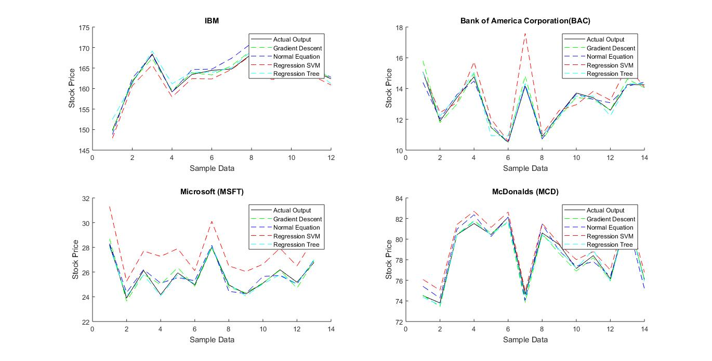
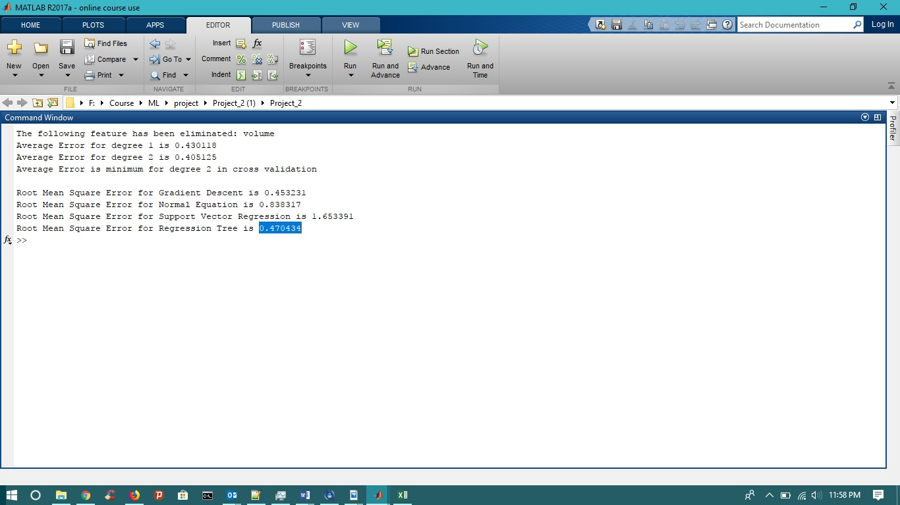

# Stock Market Prediction

## Team Members:
* Shiva Vamsi Gudivada
* Venkata Praneeth Bavirisetty
* Anuj Jain
* Pavan Siva Kumar Amarapalli

## Description:
In this project, we designed a Machine Learning model which will predict the future value of a stock from the current data. Here, we used the stock data (750 instances) of each week for 6 months, January to June 2011. This data was used to test and train our algorithm. We predicted the opening stock price over the following week. We implemented this model using different algorithms and techniques. We analyzed the results and identified the best performed algorithm.

## Installation
Clone the repository and use MATLAB/Octavia to run the code.

## Code
StockPrediction.m performs the prediction. The below scripts are used to support the code.

* assignNumbersToSymbols.m
* normalEq.m
* computeCost.m
* gradientDescentB.m
* computeCostB.m
* rootMeanSquareError.m
* regSVM.m

## Run
Place the Dow Jones Index Data Set in the same folder as the source code. Use the StockPrediction.m file to run the code in MATLAB.

## Data Set
#### _[Dow Jones Index Data Set](https://archive.ics.uci.edu/ml/datasets/dow+jones+index)_
The Dow Jones Industrial Average (DJIA) is a stock market index created by Wall Street Journal editor, Charles Dow (Dow Jones & Company co-founder). DJIA is a collection of thirty publicly traded stocks. These include multi-national companies like Apple, Coca-Cola, Intel, etc. The DJIA value is obtained by the compilation of values of each stock. The DJIA value helps to find the strength of the United States economy among other things. The closing value is reported on news networks across the United States. The sum of the prices of all the 30 stocks is divided by the Dow Divisor. The Dow divisor on September 1, 2017 was 0.145233968773.
##### _Features:_
The following 10 features were used to train and test the data:
1. Quarter
2. Stock Symbol
3. Opening price for the week
4. Highest value of stock for the week
5. Lowest value of stock for the week
6. Closing price for the week
7. Volume of shares traded
8. Percentage change in price over the previous week
9. Percentage change in volume over the previous week
10. Previous week’s volume

## Results

  
  Figure: Sample output Graphs

Based on the above results and graphs plotted for Sample test data, it is evident that regression tree and gradient descent algorithms are best suitable for this regression problem.
We believe that, the error in prediction can be further decreased by training the model with a wide range of data, probably from a different year, a different quarter and then evaluate the output for each algorithm and determine if the chosen model can be implemented for the problem.

  
  Figure: output screenshot

#### _Technologies Used:_
* _MATLAB_
